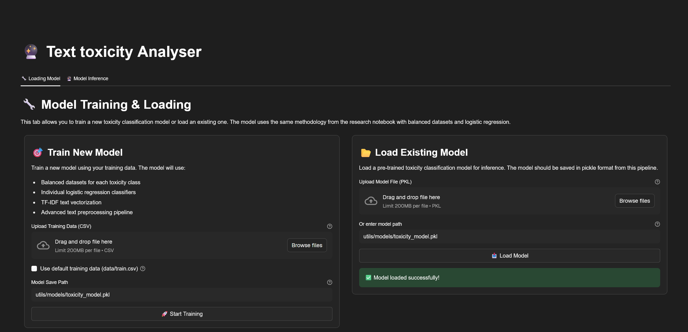
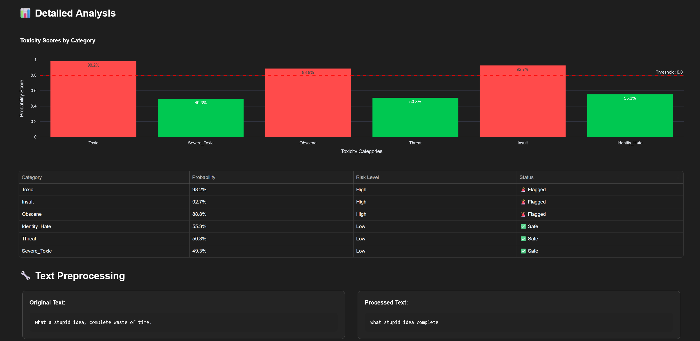
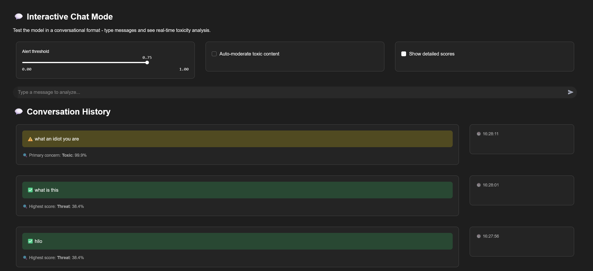

## Text Toxicity Analyser

A Streamlit-based web application that analyzes text content for toxic behavior using machine learning. The app can classify text across multiple toxicity categories including toxic, severe toxic, obscene, threat, insult, and identity hate speech. 

### Features
- **Real-time Text Analysis**: Input text and get instant toxicity predictions
- **Multi-category Classification**: Detects 6 different types of toxic content
- **Interactive Web Interface**: Built with Streamlit for easy use
- **Batch Processing**: Analyze multiple texts from CSV files
- **Visual Results**: Clear presentation of toxicity scores and classifications

